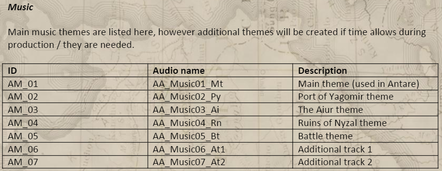
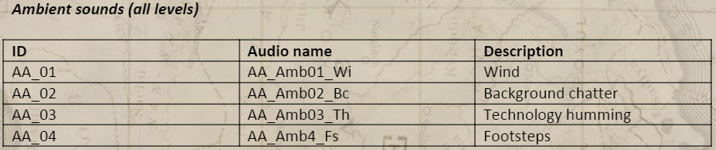
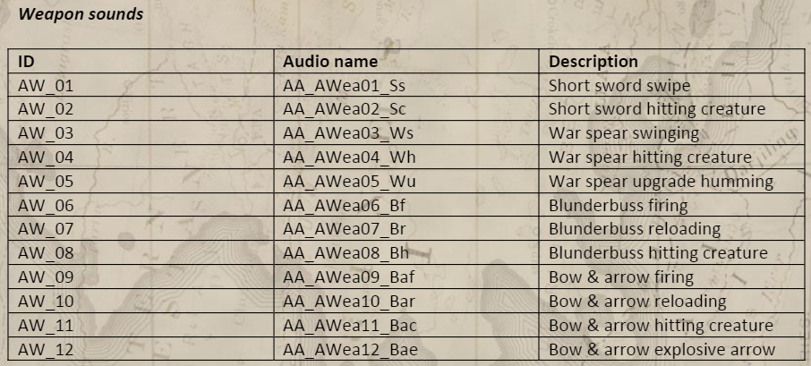

# Introduction

This is a website made with GitHub Pages that contains all the information about how to organize all the elements we need and start a video-game with a good Audio Bible.

Audio is one of the most relevant things when talking about video games, it can transport the players to other dimensions, worlds or extraordinary settings. Making players take part of a new experience. 

If you watch this video on mute, audio automaticaly will sound in your head:

*“Remember that audio is like a painting. A host of multiple elements (or “colors”) form and combine to create a larger picture.”*
says the Sound Designer Zachary Quarles on his blog about Writing an Audio Design Document.

So we have to make sure we consider all the elements needed to create a complete Audio Bible:

# Elements

## 1. Music

-We have to decide which music **Style** want for our game, depending on what type of game and public we are looking for. We want a relaxing game with relaxing music or more exciting music that maintains the player in constant action.

Look this 2 examples of diferent styles:

Game: Doom

Game: Stardew Valley

-For bigger projects, its also important the **Instrumentation** and how to **Record** the audio. We will need a simple piano for our game, or a big orchestra with lots of instruments, or any other type of instruments. This also will define the kind of game are you looking to create.

-The designers have to decide **when the music is played**, if its continuously playing during all game, in some scenes or short-cuts, on an specific area…

Watch this video where diferent musics sounds depending on what is happening:

Game: Final Fantasy VII

Minutes: 

00:57

04:55

08:20

09:47

10:30

## 2. Sound-Design

-We have to know where is the player, what is happening, the world-sound around the player, the game **Ambience**. Is the player in a quite forest alone with the only sound of wind, or is in the middle of a city with lots of cars and people?

-Its very important the audio **feedback** from the players, the weapons, items, abilities, etc.
We need feedback from item in use, if the player is using some specific weapon. Are these sounds very important in your scene, or more secondary?

-What will the player find on his way to the objective? It will be Monsters, some enemies trying to kill you, some obstacles? Each enemy or obstacle is different, so we have to know how they are to decide witch sounds will fit witch each one.

-It is needed that each **visual effect** has a sound. An explosion, some raindrops, river going down a mountain.

-The **player** have it’s own sounds, its footsteps, shout of pain, its exhaustion while running, death…

In this two videos we can hear the ambience Sound on a forest, different weapons sounds, the different sounds that different monsters do depending on their form/agresivity/power...:

Game: The Forest

## 3. Voice-Over

-Is there a Story told by a narrator? Voices during game-play?

-We need a big cast for all voices? Which kind of voices do we need? Age, gender, etc.

-Some characters, monsters, machines, need some Special effect Voices, sometimes is necessary doing some sound processing.

In this two videos we can see the difference between a story told by a narrator and a story told during gameplay by the player:

Game: Darkest Dungeon

Minute 00:12

Game: GTA V 

Minute 00:15

## 4. Technology

-Its important to know the limits of the platform/program.

-Will we need lots of audio channels?

-How are we getting the audio? It will sound and fit perfectly as you thought?

# Reference materials and Inspiration

Having a reference when deciding what audios you will need, helps to get to objectives and goals that we are looking for.

Some short clip sounds can help to create the sound you are looking for. If you are creating a raindrop, footsteps on snow, waterfall, etc.… this can help.

Also some other video-games or films can be a reference for your video-game if you are looking for a similar music or sounds.

If you are looking for an open world multiplayer RPG, you can get inspiration for exaple from World of Warcraft:

Otherwise, if you are looking for a more relaxing and artistic game, Journey is a good example:

# Audio Organization and Naming

When designing and developing a video game, a clear naming and organization will be crucial for you and your team members to find all you need and don’t lose anything. 

There is not only a way to do this, but it’s very important for keeping your audio organized, finding all files, not losing anything, don't waste useful time...

Here we can see how music assets can be organized on a table:

-First column for Asset ID, **AM(for Audio Music)__(Number of the file)**

-Second column for file naming, **AA(for Audio Asset)__Music01(type of audio and number)__Mt(description Initials for Main Theme)**

-Third column for a short description of the audio

This table can be done for every audio type, music, ambient sounds, weapon sounds, enemy sounds etc...

# Template

[Link to template](https://github.com/MaxLlovera/Research_Audio_Bible/tree/main/template)

# Bibliography

[Rocket Powered Hippo - Sound Design Document](https://issuu.com/rocket_powered_hippo/docs/sounddesignfinal)

[Zachary Quarles Blog](http://zacharyquarles.com/blog/?p=518)

[Game Audio and Digital Art Blog](https://annesoaudio.com/category/category-1/game-audio/page/2/)
