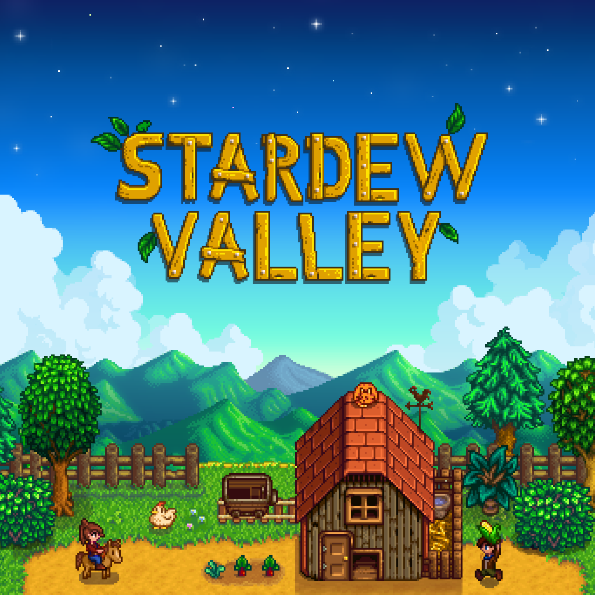

# Introduction

This is a website made with GitHub Pages that contains all the information about how to organize all the elements we need and start a video-game with a good Audio Bible.

Audio is one of the most relevant things when talking about video games, it can transport the players to other dimensions, worlds or extraordinary settings. Making players take part of a new experience. 

If you watch this video on mute, audio automaticaly will sound in your head:

*“Remember that audio is like a painting. A host of multiple elements (or “colors”) form and combine to create a larger picture.”*
says the Sound Designer Zachary Quarles on his blog about Writing an Audio Design Document.

So we have to make sure we consider all the elements needed to create a complete Audio Bible:

# Elements

## 1. Music

-We have to decide which music **Style** want for our game, depending on what type of game and public we are looking for. We want a relaxing game with relaxing music or more exciting music that maintains the player in constant action.

Look this 2 examples of diferent styles:

Doom:

Stardew Valley:

## 2. Sound-Design

## 3. Voice-Over

## 4. Technology

# Reference materials and Inspiration

# Audio Organization and Naming
